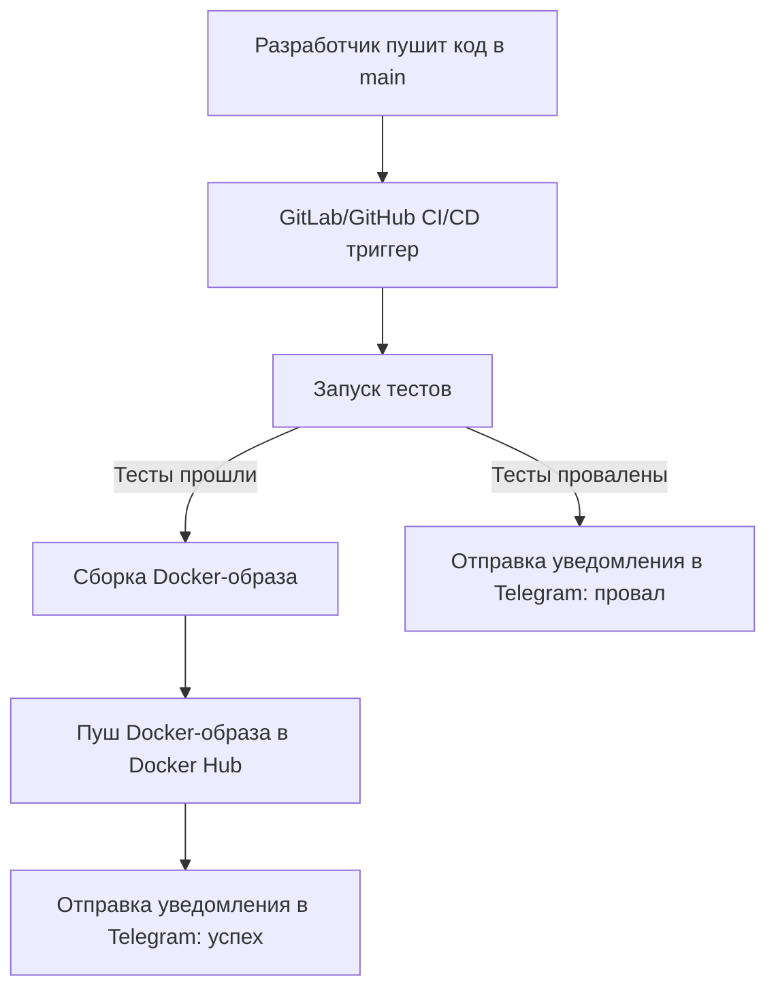

# Схема работы CI/CD

Для просмотра схемы необходимо использовать `Mermaid`

```mermaid
flowchart TD
    A[Разработчик пушит код в main] --> B[GitLab/GitHub CI/CD триггер]
    B --> C[Запуск тестов]
    C -->|Тесты прошли| D[Сборка Docker-образа]
    C -->|Тесты провалены| G[Отправка уведомления в Telegram: провал]
    D --> E[Пуш Docker-образа в Docker Hub]
    E --> F[Отправка уведомления в Telegram: успех]
```